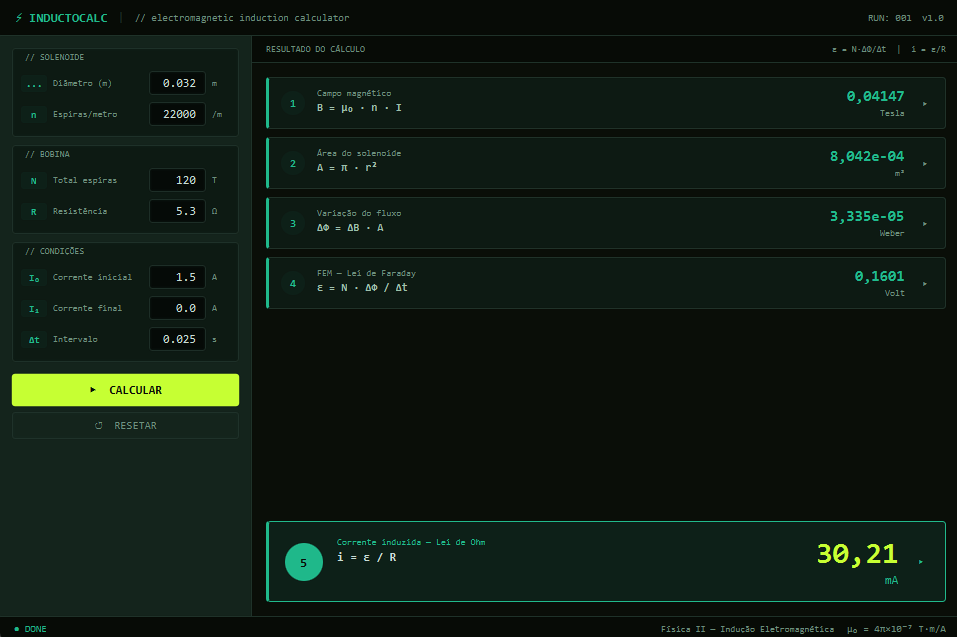
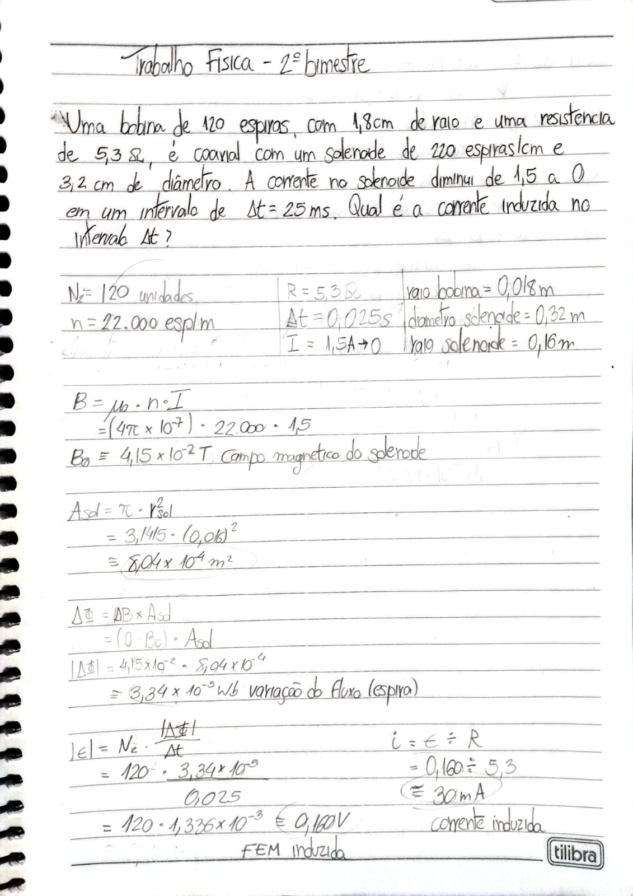

# ⚡ InductoCalc — Calculadora de Indução Eletromagnética

> **Trabalho acadêmico** desenvolvido para a disciplina de **Física**, com o
> objetivo de aplicar os conceitos de indução eletromagnética (Lei de
> Faraday-Lenz) em uma solução computacional interativa.

---



## 📖 Sobre o projeto

O **InductoCalc** é uma aplicação desktop em Java/JavaFX que resolve, passo a
passo, um problema clássico de indução eletromagnética em um solenoide: dado
um conjunto de parâmetros de entrada (dimensões da bobina, número de espiras,
resistência, correntes inicial/final e intervalo de tempo), o programa calcula
o campo magnético, a área do solenoide, a variação de fluxo magnético, a força
eletromotriz (FEM) induzida e, por fim, a corrente induzida.

Além do resultado final, cada etapa do cálculo pode ser expandida na própria
interface para mostrar a substituição dos valores na fórmula — reforçando o
raciocínio físico por trás do resultado, não apenas o número final.

## 🎯 Objetivo acadêmico

O projeto foi criado como exercício prático de:
- Aplicação das leis de Faraday e Lenz e da Lei de Ohm em um cenário
  realista de solenoide;
- Modelagem orientada a objetos em Java (separação em `Models`,
  `Controllers` e `Views`);
- Construção de interface gráfica com JavaFX, incluindo validação de
  entradas e feedback visual do processo de cálculo.

## 🧮 Fundamentação teórica

O cálculo segue 5 etapas sequenciais:

| # | Etapa | Fórmula |
|---|-------|---------|
| 1 | Campo magnético do solenoide | `B = μ₀ · n · I` |
| 2 | Área do solenoide | `A = π · r²` |
| 3 | Variação do fluxo magnético | `ΔΦ = ΔB · A` |
| 4 | FEM induzida — Lei de Faraday | `ε = N · ΔΦ / Δt` |
| 5 | Corrente induzida — Lei de Ohm | `i = ε / R` |

Onde:
- `μ₀` — permeabilidade magnética do vácuo (4π×10⁻⁷ T·m/A)
- `n` — densidade de espiras do solenoide (espiras/metro)
- `I` — corrente elétrica (inicial ou final, conforme a etapa)
- `r` — raio do solenoide (derivado do diâmetro informado)
- `N` — número total de espiras da bobina
- `Δt` — intervalo de tempo da variação de corrente
- `R` — resistência da bobina

> O sinal de `ΔΦ`, `ε` e `i` segue a Lei de Lenz (indica o sentido da
> grandeza); o valor absoluto é o que é exibido como resultado principal.

## 🖥️ Funcionalidades

- **Validação de entradas** — cada campo é checado contra faixas físicas
  plausíveis antes do cálculo (ver tabela abaixo);
- **Cálculo passo a passo** — os 5 resultados são apresentados em cards
  numerados, na ordem lógica do raciocínio físico;
- **Detalhamento expansível** — clicar em qualquer card revela o cálculo
  completo daquele passo, com os valores numéricos substituídos na fórmula;
- **Tema visual "carbon/terminal"** — interface escura com destaques em
  verde-água e lima, pensada para leitura confortável de fórmulas e números;
- **Reset** — limpa entradas, resultados e detalhamentos com um clique.

## 🗂️ Estrutura do projeto

```
src/
 ├─ Models/
 │   ├─ Configuracoes.java   → constantes físicas e faixas de validação
 │   └─ DadosEntrada.java    → dados de entrada do usuário (com validação)
 ├─ Controllers/
 │   └─ CalculadoraController.java → lógica de cálculo (passos 1 a 5)
 └─ Views/
     └─ CalculadoraView.java → interface gráfica (JavaFX)
```

## ✅ Faixas de validação (`Configuracoes.java`)

| Grandeza | Mínimo | Máximo |
|---|---|---|
| Resistência da bobina (Ω) | 0.1 | 1000.0 |
| Corrente inicial/final (A) | 0.0 | 100.0 |
| Diâmetro do solenoide (m) | 0.002 | 2.0 |
| Raio do solenoide (m) | 0.001 | 1.0 |
| Intervalo de tempo (s) | 0.001 | 3600.0 |
| Total de espiras | 1 | 10000 |
| Densidade de espiras (esp./m) | 1 | 100000 |
| Área do solenoide calculada (m²) | 3.14×10⁻⁶ | 3.14 |
| Campo magnético calculado (T) | 0.0 | 12.57 |
| Variação de fluxo calculada (Wb) | −39.5 | 39.5 |
| FEM induzida calculada (V) | −100000 | 100000 |
| Corrente induzida calculada (A) | −1000 | 1000 |

## 🚀 Como executar

Pré-requisitos:
- JDK compatível com JavaFX 21;
- JavaFX SDK 21 instalado localmente.

No Eclipse:
1. Importe o projeto;
2. Vá em **Run → Run Configurations → Arguments**;
3. Em **VM arguments**, adicione:
   ```
   --module-path "C:\javafx-sdk-21\lib" --add-modules javafx.controls
   ```
   (ajuste o caminho para onde o JavaFX SDK estiver instalado no seu sistema)
4. Execute a classe `Views.CalculadoraView`.

### Problema resolvido no caderno
Resolução manual do problema de indução eletromagnética, usada como base e
verificação para os resultados calculados pela aplicação.



## 👤 Autoria

- **Autor(a):** Erick Matheus Frias Rafael
- **Curso / Instituição:** Ciência da Computação / UNESPAR
- **Disciplina:** Física II — Indução Eletromagnética
- **Professor(a):** Willyan Henrique Pontim Bertolino
- **Data:** 07/2026

---
*Projeto desenvolvido para fins didáticos, como parte da avaliação da
disciplina de Física.*
